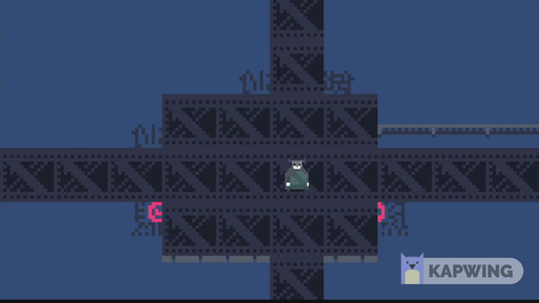

# 2D-Grid-Movement---Unity

 

this is a simple 2D grid movement script where the plaper can move in a grid where the developer can edit in the editor, but the grid size must be directly proportional to the speed in the speed to grid size ratio of 10:1

**HOPE YOU MAKE GREAT GAMES WITH THIS CONTROLLER**
